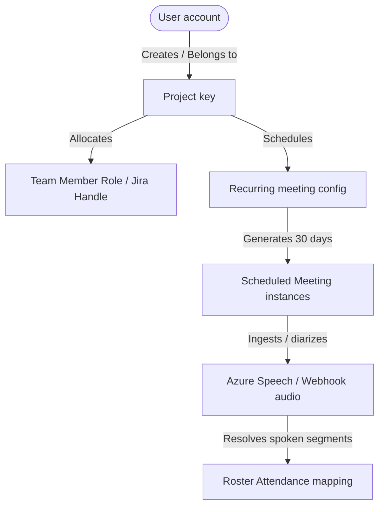

# 🗺️ Platform Living Context & Architectural Blueprint

This document serves as the **ground-truth context repository** for the Engineering Manager Platform. It is a living document that must be reviewed and updated by the AI agent during every enhancement cycle to ensure continuous architectural integrity, regression-safety, and seamless developer handoffs.

---

## 🛠️ 1. Platform Architectural Core

The platform is a multi-tenant engineering management system powered by dynamic AI agents, secure REST APIs, and database persistence.

### Component Relationship Flow:

### Key Technical Specs:
* **Core API Framework:** FastAPI with Uvicorn server (port 8000).
* **Database Layer:** SQLAlchemy 2.0 ORM over SQLite (development WAL mode) and PostgreSQL (production).
* **Field-Level Encryption:** Fernet symmetric encryption protecting sensitive corporate variables (Jira API tokens, SMTP passwords).
* **Multi-Agent Orchestration:** LangGraph state graph supervising specialized nodes (Data Analyst, Automation, Jira Sync, and Transcription agents).

---

## 📅 2. Standup Meeting & Scheduling Sync (Direct UI Sync)

One of the most robust architectural enhancements is the **Direct UI Scheduling Sync** bridging Project configurations to actual calendar queues.

### How Standup Scheduling Works:
* **The Config Inputs:** On the **Projects** tab, the user sets `Standup Time (HH:MM)` (e.g. `20:32`), `Meeting Integration` (Manual, Teams, or Zoom), and `Timezone`.
* **Meeting Integration & Auto-Provisioning:** 
  * If `"Microsoft Teams (Auto-Provision)"` or `"Zoom (Auto-Provision)"` is selected, the backend **automatically generates a unique conference URL on-the-fly** during synchronization (e.g., `https://zoom.us/j/...` or `https://teams.microsoft.com/l/...`) and updates the `Project.meeting_link` dynamically.
  * **Automatic Cloud Recording:** When provisioning meetings, the system enforces **automatic cloud recording** so that meetings are captured directly in the cloud without host latency:
    * *Zoom:* Sets `settings.auto_recording = "cloud"` in the API request payload.
    * *Microsoft Teams:* Sets `recordAutomatically = true` in the MS Graph API request payload.
  * Setting a custom provider hides the manual text box and enables an information badge in the UI.
* **Under-The-Hood Sync:** Saving this form triggers `_sync_project_standup_recurring_meeting` in the backend (`projects.py`).
  1. It automatically registers or updates a `RecurringMeeting` of type `MeetingType.STANDUP` for the project.
  2. **Weekdays Only:** By default, standard Scrum standup instances are scheduled for weekdays (**Monday through Friday**) for the next 30 days.
  3. **In-Place Invitation Updates:** When standup settings shift (such as a time, timezone, or link change), instead of deleting future meeting instances, the system modifies all future `scheduled` meetings **in-place**. It shifts their start time, updates their meeting link, and increments their `ical_sequence` counter. This keeps their database primary key IDs and unique `ical_uid` values completely intact, which standard calendar clients (e.g. Outlook/Google) interpret as an update/modification rather than a brand-new invitation.
* **Timezone Standard:** All start/end times in the database are stored as **naive UTC** datetimes. For example, if a user in **IST (UTC +5:30)** enters `20:32` local time, this must be stored/calculated relative to the server's UTC timeline.
* **Reference Link:** The dynamically generated or manually pasted call link serves as the reference link the agent joins, sends reminders for, and references.
* **Dynamic iCalendar (`.ics`) Invite Attachment:** In `send_email_report()` inside `agent_tools.py`, the system dynamically compiles standard `.ics` invite attachments for tomorrow's standup and emails them to the roster. Outlook/Google/Apple Calendar clients automatically parse these as active invite calendar cards.

---

## 🤖 3. Background Automation & Zoom Webhooks

* **Pre-Meeting HTML Reminders:** A background daemon checks every 30 seconds. If a scheduled meeting is starting in `10 minutes`, it sends an HTML email template with call links to all project roster recipients and sets `reminder_sent = True`.
* **Stopwatch & Active Standup:** The **Meetings** tab features an active Stopwatch. Clicking `Start Meeting` instantly creates and starts an active meeting.
* **AI Sync Countdown Banner:** A dynamic JS controller in `app.js` polls meetings and displays the upcoming standup countdown:
  > 🤖 *Next meeting scheduled in 10 mins. Agent is ready to join!*
* **Option A Chatbot (`POST /api/zoom/messages`):** Outgoing webhook routing Zoom chat channel messages to the supervisor graph, returning consolidated analytics.
* **Option B Recording Webhook (`POST /api/zoom/recordings`):** Listens for completed cloud recordings. Downloads meeting audio, executes high-fidelity speech-to-text speaker diarization (`transcription_agent_node`), logs speaker segments, auto-marks attendance roster based on voice, compiles sprint summaries, and emails status updates.

---

## 🧪 4. Quality Assurance & Test Strategy

* **Test Suite:** Houses 10 test modules verifying user registration, RBAC permissions, encrypted fields, project configuration, meeting stopwatch controls, and Zoom handshakes.
* **Current Status:** All **133 tests** are fully passing (100% green).
* **Developer Guidelines for Testing:** 
  * SQLite in-memory or WAL connections can fail with `Cannot operate on a closed database` when client test calls interleave with open queries.
  * **Rule:** Always isolate database query blocks from API client requests by creating, querying, and closing a `TestSession()` before making a `client.post()` or `client.put()`, and doing the same for subsequent assertions.

---

## 📈 5. Future Enhancement Directives

When implementing future enhancements, always adhere to these rules:
1. **Never Break Roster Mapping:** Any new speaker diarization parser must successfully resolve custom handles to the SQLite `users` table allocated via project `team_members`.
2. **Preserve Scheduling Sync:** Do not bypass the `_sync_project_standup_recurring_meeting` helper when modifying project details.
3. **Always Run the full suite:** Execute `venv/bin/pytest -v` to ensure zero regressions after making structural adjustments.
4. **Update This Context File:** Document any new feature addition, schema upgrade, or endpoint modification in this file before ending your turn.
